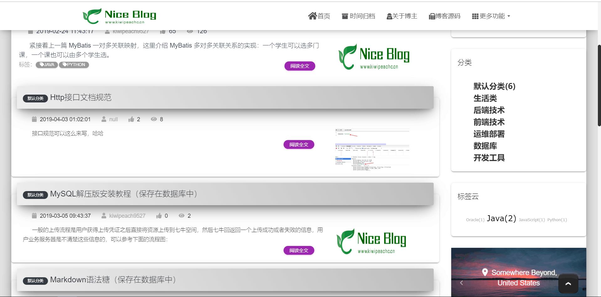
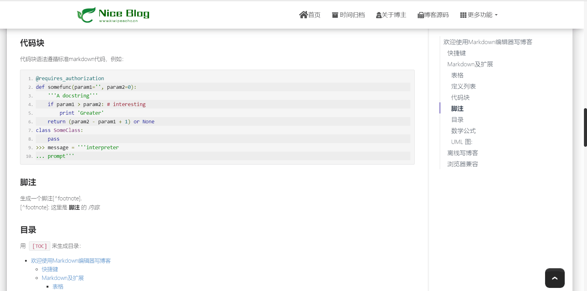
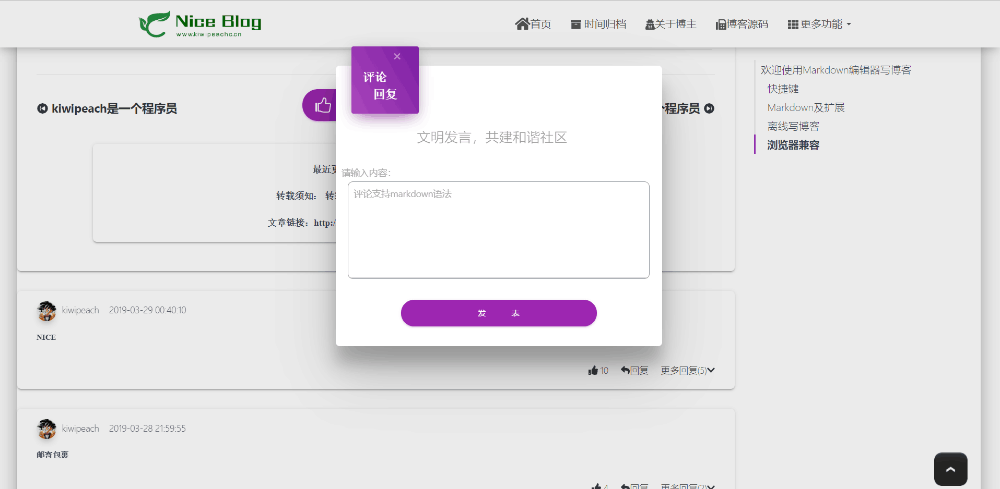
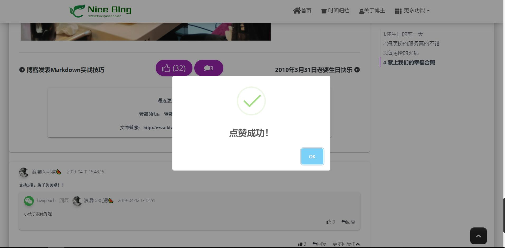
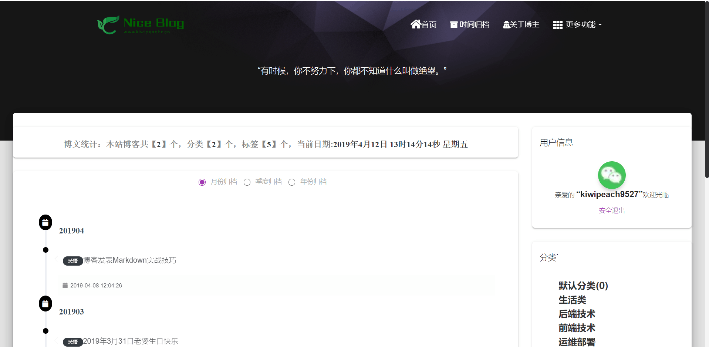
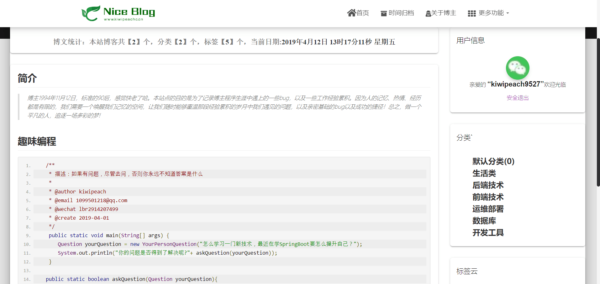

<p align=center>
  <a href="http://www.kiwipeach.cn">
    
  </a>
</p>
<p align=center>
   Nice Blog System 是一个基于Java开发，“便捷轻巧、高性能、外形Nice”的博客系统
</p>

<p align="center">
  <a href="https://gitee.com/KiWiPeach/nice-blog-sys"></a>
    <a href="https://gitee.com/KiWiPeach/nice-blog-sys"></a>
<a target="_blank" href="https://www.oracle.com/technetwork/java/javase/downloads/index.html">
		</img>
	</a>

</p>
<p align="center">
 <a href="javascript:;">QQ交流群 :679722876</p>
</p>

## 项目说明

 纯Java编写的个人博客系统，力求以`便捷轻巧、高性能、外形Nice`为目标，适用于个人快速搭建博客平台。我不完美，但向往远方。[在线演示](http://www.kiwipeach.cn) 

## 项目特点

- 最新的技术选型,使用SpirngBoot最新版本(当前2.1.3.RELEASE)，关注我就等于关注最新SpringBoot整合技巧方案，(*^__^*).....
- 项目技术选型[maven，spring-boot,mybatis-plus,shiro,thymeleaf,bootstrap4，jquery....]
- 支持多平台(q、github、gitee)社交账号登陆及本地系统账号登录。
- Shiro做安全权限验证，博客资源链接能做安全过滤，权限管理,对于私密链接有保障。
- 使用了Redis缓存，提升博客网站的性能。
- 博客系统同时支持MySQL和Oracle数据库。
- 独具特色的评论回复功能，增强博客的互动性。
- 采用国内七牛云图床，简单、稳定、易用。
- 持续开源更新，站长亲自撸码，经久不衰的持续更新。

## 安装教程

##### 步骤一：环境准备

| 环境依赖                 | 描述                          |
| ------------------------ | ----------------------------- |
| 数据库                   | MySQL或者Oracle，二选一       |
| Java Runtime Environment | 推荐使用jdk1.8及1.8以上的版本 |
| Redis                    | 应用缓存，缓解数据库访问压力  |

##### 步骤二：修改配置

```yaml
#数据库配置
spirng
    datasource:
    username: <?>
    password: <?>
    url: <?>
    ....
    
#Redis配置
    cache:
    type: redis
    redis:
    host: <?>
    password: <?>
    ......	
#三方登录配置(qq,github.gitee)
qq:
  client:
    app_ID: <?>
    app_KEY: <?>
    ......
github:
  client:
    clientId: <?>
    clientSecret: <?>
    ......
gitee:
  client:
    clientId: <?>
    clientSecret: <?>
    ......
    
#千牛图床配置
qiniu:
  access-key: <?>
  private-key: <?>
  ......
```
##### 步骤四：运行程序

```shell
#本地运行
nice-blog-sys/blog-sys-web/src/main/java/cn/kiwipeach/blog/BlogWebApplication.java

#jar包运行
nohup java -Xms513m -Xmx1024m -jar NiceBlog.jar --spring.profiles.active=mysql-active  &
```

## 系统运行截图

##### 博客首页



##### 博客详情



##### 博客评论回复



##### 博客点赞



##### 博客归档



##### 博客关于我



##### 博客后台(待开发):


##### 发表博文界面(待开发)：


